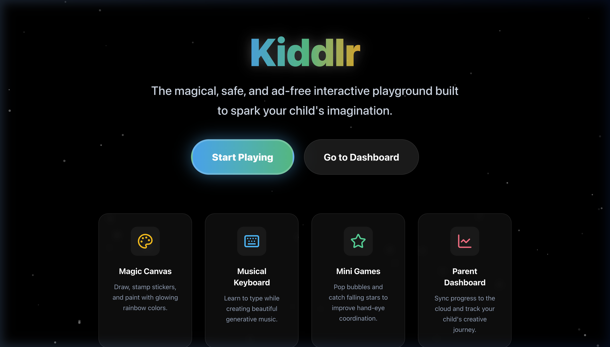
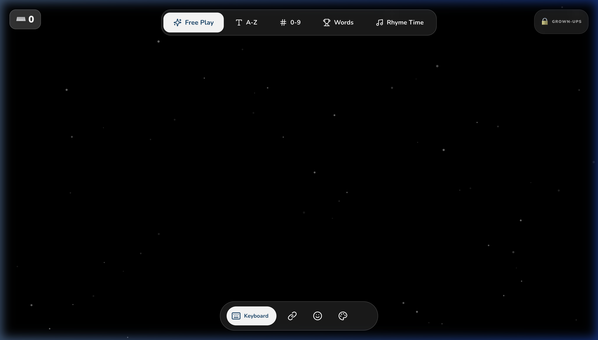
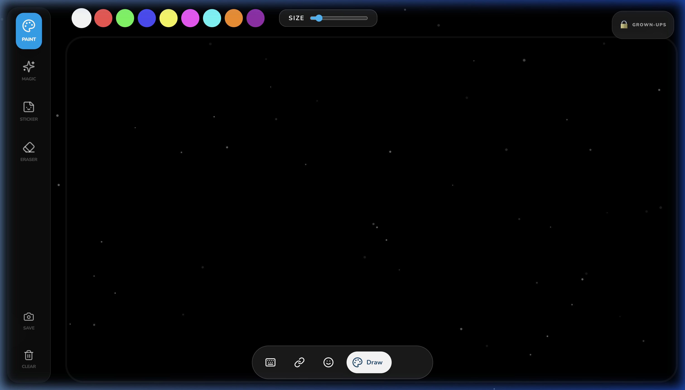
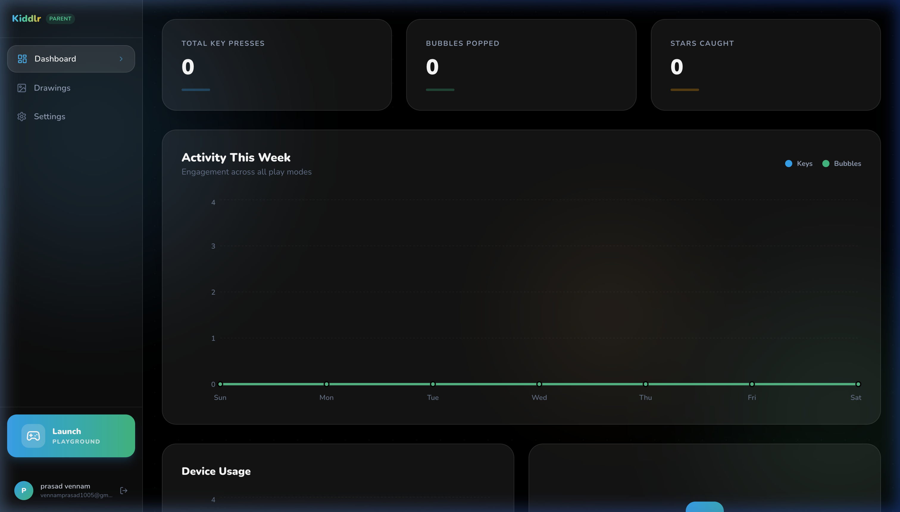
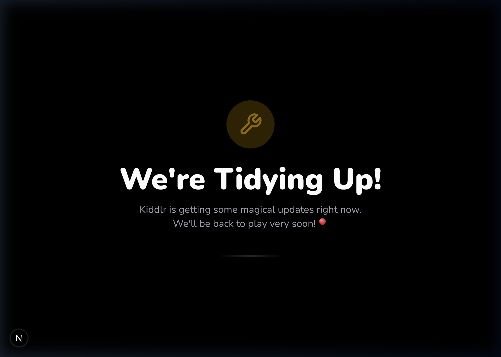

<div align="center">


# 🎨 Kiddlr

### A magical, interactive typing and creativity app for kids aged 2–10  
Built with love using **Next.js 15**, **PixiJS**, **Firebase**, and **Tone.js**

</div>

---

## ✨ Live Features

### 🏠 Landing Page
A beautiful, animated landing page with drifting particle effects that guides parents and children into the app.



---

### ⌨️ Keyboard Zone — Free Play to Guided Typing
The core learning experience. Every key press triggers a **musical note** (pentatonic scale) and a colorful **letter burst**.



**5 Learning Modes:**
| Mode | Description |
|------|-------------|
| 🌟 **Free Play** | Every key makes music and bursts of color |
| 🔤 **A-Z Mode** | Practice the alphabet sequentially with visual guides |
| 🔢 **0-9 Mode** | Practice number typing in order |
| 🏆 **Words Mode** | Spell kid-friendly words by category (Animals, Fruits, Colors, Veggies) |
| 🎵 **Rhyme Time** | Type a word that rhymes with the displayed word. Powered by Datamuse API |

---

### 🎨 Magic Canvas — Drawing Studio
A full-featured drawing studio powered by **PixiJS WebGL**.



**Tools available:**
- 🖌️ **Paint** — Smooth brush with full color palette
- ✨ **Magic** — Rainbow-shifting hue brush
- 🪄 **Sparkle** — Particle brush that leaves a glitter trail
- 📌 **Sticker** — 12 animated emoji stamps with a pop-in effect
- 🧹 **Eraser** — True pixel-erasing using PixiJS blend mode
- 📷 **Save** — Downloads `.png` locally + uploads to Firebase Storage if logged in
- 🗑️ **Clear** — Instantly wipes the entire canvas

---


| Game | Description | API |
|------|-------------|-----|
| 💬 **Word Association** | Type any word related to the displayed word | Datamuse `?rel_trg=` |
| 🐮 **Animal Sounds** | Hear a sound and type the animal's name | Built-in + Web Speech |
| 🔄 **Opposite Day** | Type the antonym of the displayed word | Datamuse `?rel_ant=` |
| 😊 **Emoji Decoder** | Type the word matching the displayed emoji | Offline mapping |

---

### 🔊 Voice Prompts (Web Speech API)
The app now **talks to kids**! Using the Web Speech API:
- **New challenges** are announced aloud ("Find a word that rhymes with CAT!")
- **Success** is praised verbally ("Great job!", "You did it!")
- Graceful fallback for unsupported browsers — no crashes

---

### 👨‍👩‍👧 Parent Portal
A protected dashboard for parents with analytics and controls.



**Features:**
- 🔐 **Firebase Auth** — Google & Email sign-in
- 📊 **Live Stats** — Recharts graphs of key presses
- 🖼️ **Drawing Gallery** — View all saved artwork uploaded to Firebase Storage
- ⚙️ **Settings** — Toggle sound, animations, and child difficulty preferences
- 👤 **Profile Setup** — Enter Child's name, age, and learning preferences on first login
- ⚙️ **Remote Switches** — Change any feature (A-Z, Draw, Bubbles, etc.) or enable maintenance mode instantly from the Firebase Console.

---

## ⚙️ Remote Configuration
Kiddlr uses **Firebase Remote Config** for real-time feature management without app redeployment.

- **Feature Toggling**: Individual flags like `showKeyboard`, `showDraw`, `showBubbles`, etc., can hide navigation items instantly.
- **Maintenance Mode**: A global `useMaintenanceMode` flag to safely update the app.
- **AI Word Switch**: Toggle `useAIWords` to switch between local word banks and AI-powered generation.



---

## 🌐 Live Demo
The application is now live on Firebase Hosting:
👉 **[kiddlr.web.app](https://kiddlr.web.app)**


---

## 🛠️ Tech Stack

| Layer | Technology |
|-------|------------|
| Framework | Next.js 15 (App Router) |
| Rendering | PixiJS v8 (WebGL) |
| Audio | Tone.js + Web Speech API |
| Styling | Tailwind CSS v4 |
| State | Zustand |
| Backend | Firebase (Auth, Firestore, Storage, Remote Config, Analytics) |
| Monorepo | Turborepo |

---

## 📁 Project Structure

```
kidsTypo/
├── apps/
│   └── web/                  # Next.js 15 App
│       ├── app/              # Pages (/, /play, /login, /setup, /dashboard)
│       ├── components/
│       │   ├── play/         # KeyboardZone, DrawCanvas, mini-games
│       │   ├── parent/       # Dashboard, DrawingGallery, SettingsForm
│       │   ├── providers/    # RemoteConfigProvider, AuthProvider, AnalyticsProvider
│       │   ├── ui/           # BottomNav, shared UI
│       │   └── effects/      # BackgroundEffects (particle rain, sparkle trail)
│       ├── hooks/            # usePixiApp (shared PIXI lifecycle)
│       ├── lib/              # audio.ts, speech.ts, firebase.ts
│       └── store/            # useAppStore (Zustand)
├── packages/
│   ├── types/                # Shared TypeScript types
│   ├── ui/                   # Shared React components
│   └── config/               # Shared ESLint & TS config
└── turbo.json
```

---

## 🚀 Getting Started

```bash
# Install dependencies
npm install

# Start the development server
npm run dev
# → App runs at http://localhost:3002

# Build for production
npm run build
```

---

## 🔧 Environment Variables

Create `apps/web/.env.local` with your Firebase config:

```env
NEXT_PUBLIC_FIREBASE_API_KEY=...
NEXT_PUBLIC_FIREBASE_AUTH_DOMAIN=...
NEXT_PUBLIC_FIREBASE_PROJECT_ID=...
NEXT_PUBLIC_FIREBASE_STORAGE_BUCKET=...
NEXT_PUBLIC_FIREBASE_MESSAGING_SENDER_ID=...
NEXT_PUBLIC_FIREBASE_APP_ID=...
```

---

## 🧪 Testing

Unit tests are configured using **Vitest**:

```bash
# Run tests
cd apps/web && npx vitest run
```

Tested modules:
- `lib/speech.ts` — SpeechManager (Web Speech API wrapper)

---

## 🗺️ Roadmap

- [ ] **PWA / Offline Mode** — Service Worker + IndexedDB for offline play
- [ ] **React Native / Expo** — Mobile app with native keyboard and touch support
- [ ] **Dyslexia-Friendly Mode** — OpenDyslexic font + high-contrast palette
- [ ] **Microphone Input** — Kids can spell by saying letters out loud
- [ ] **Achievement System** — Badges, streaks, and rewards for parents to celebrate
- [ ] **Multi-language Support** — Spanish, French, Hindi modes

---

## 🤝 Contributing & Open Source
Kiddlr is an **Open Source** project! We believe in creating the best educational tools for children through community collaboration.

### 🚀 How to Contribute
We love Pull Requests! Whether it's a new mini-game, a bug fix, or a new language translation:
1. **Fork** the repository.
2. Create your **Feature Branch** (`git checkout -b feature/AmazingFeature`).
3. **Commit** your changes (`git commit -m 'feat: add amazing feature'`).
4. **Push** to the branch (`git push origin feature/AmazingFeature`).
5. Open a **Pull Request**.

See [CONTRIBUTING.md](CONTRIBUTING.md) for more detailed guidelines.

---

## 🤖 Acknowledgements
This project was developed in collaboration with **Antigravity**, a powerful AI coding agent. 
- **AI-First Development**: Built using advanced agentic workflows.
- **Frameworks**: 100% React-based architecture with Next.js 15.
- **Mission**: Demonstrating how AI and humans can co-create premium, high-impact educational software.

---

## 📄 License
MIT © [vennamprasad](https://github.com/vennamprasad)

---

<div align="center">

Made with ❤️ for tiny fingers everywhere 🐣

</div>
